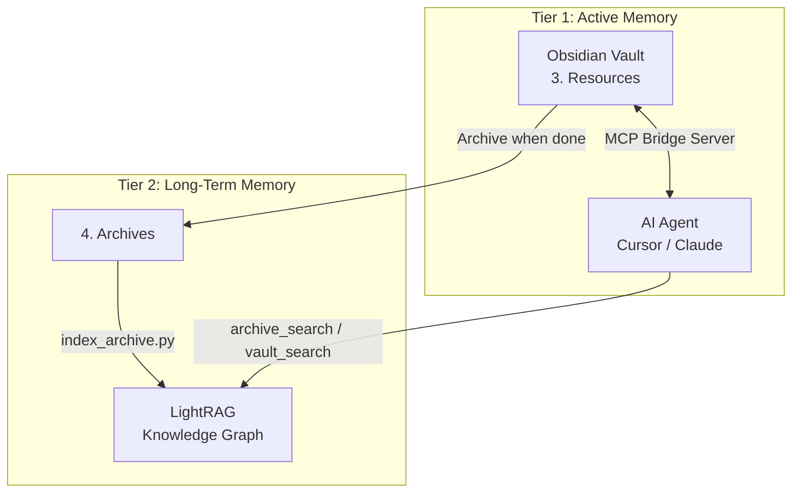

<div align="center">
  <h1>🧠 Zero-Cost Virtual Brain</h1>
  <p><b>A local, private, and free AI memory system powered by LightRAG and MCP.</b></p>
</div>

<p align="center">
  <a href="#features">Features</a> •
  <a href="#architecture">Architecture</a> •
  <a href="#prerequisites">Prerequisites</a> •
  <a href="#installation">Installation</a> •
  <a href="#usage">Usage</a>
</p>

---

The **Zero-Cost Virtual Brain** connects your daily active thought process (your Obsidian vault) with deep, historical knowledge (your archives) by automatically constructing and querying a dense **Knowledge Graph**. 

Engineered to run entirely on constrained consumer hardware (e.g., a 6GB VRAM RTX 4050), it ensures your private data never touches the cloud. It features native **Model Context Protocol (MCP)** integration, allowing agents like Claude or Cursor to read, write, and search your personal knowledge base autonomously.

## ✨ Features

- **100% Local & Private:** No APIs required. Runs via Ollama, keeping your data strictly on your machine.
- **VRAM Optimized:** Specifically tuned to run both a reasoning model (`qwen3.5:4b`) and an embedding model (`nomic-embed-text`) simultaneously within 6GB VRAM.
- **Knowledge Graph Engine:** Utilizes [LightRAG](https://github.com/HKUDS/LightRAG) to extract entities and relationships, enabling deep, thematic queries across years of archives.
- **Agentic Integration (MCP):** Exposes tools (`archive_search`, `vault_search`, `save_active_note`) via a FastMCP bridge server, turning your vault into long-term memory for AI agents.
- **Incremental Indexing:** Smart hashing ensures only new or modified files are processed, saving time and compute.
- **Hybrid Support:** Easily switch between local models and cloud providers (like Google Gemini) via a simple `.env` toggle.

## 🏗️ Architecture

The Brain mimics human memory by dividing data into two distinct tiers:

1. **Active Vault (Short-Term):** Your daily workspace (e.g., `3. Resources`). Fluid and constantly changing. AI agents read and write here instantly.
2. **Archive Knowledge Graph (Long-Term):** Your finished projects and ingested data (e.g., `4. Archives`). Deeply indexed into a LightRAG Knowledge Graph for complex semantic retrieval.



## 📋 Prerequisites

- **Python 3.10+**
- **Ollama:** Installed and running locally.
- **Hardware:** Minimum 6GB VRAM (NVIDIA recommended for optimal performance).

## 🚀 Installation

1. **Clone the repository:**
   ```bash
   git clone https://github.com/asiriji-lab/Personal-ai-archive.git
   cd Personal-ai-archive
   ```

2. **Install Python dependencies:**
   ```bash
   pip install -r requirements.txt
   ```

3. **Pull required local models via Ollama:**
   ```bash
   ollama pull qwen3.5:4b
   ollama pull nomic-embed-text
   ```

4. **Configure Environment:**
   Copy the example environment file and adjust the paths to point to your Vault/Archives.
   ```bash
   cp .env.example .env
   ```

## 💻 Usage

### 1. Build the Brain (Indexing)
Run the indexer to scan your archives and build the initial Knowledge Graph. Subsequent runs will only process new or modified files.
```bash
python index_archive.py
```

### 2. Start the MCP Bridge Server
Launch the FastMCP server to expose your Brain to AI agents (like Claude Desktop or Cursor).
```bash
python brain_server.py
```

### 3. Launch the Dashboard (TUI)
Monitor GPU usage, view indexing status, and launch tasks from the terminal cockpit.
```bash
python brain_tui.py
```

### 4. Explore the Graph
Visualize the entities and connections the AI has learned from your data.
```bash
python brain_explorer.py
```

## 📁 Project Structure

### ⚙️ Core Engine
- `config.py`: Central configuration (paths, models, settings).
- `utils.py`: Shared utilities (GPU monitoring, sanitization, chunking).
- `index_archive.py`: Incremental indexer that builds the Knowledge Graph.
- `brain_server.py`: FastMCP server exposing memory tools to AI agents.
- `query.py`: Core logic for executing semantic searches.
- `embed.py`: Embedding generation and manifest management.

### 🛠️ Dashboards & Visualization
- `brain_tui.py`: Terminal-based dashboard for system monitoring.
- `brain_explorer.py`: Web-based knowledge graph explorer.
- `visualize_graph.py`: Tool for generating static graph visualizations.

### 📥 Data Ingestion
- `fetch_papers.py`: Automatically fetch and archive AI research papers.
- `news_ingest.py`: Ingest news articles into the archival memory.
- `watch_archive.py`: Background service to watch for file changes and auto-index.

### 🧪 Testing & Evaluation
- `test_brain.py`: Interactive CLI for testing graph queries.
- `test_llm_speed.py`: Benchmark tool for local LLM generation speed.
- `eval/run_eval.py`: Evaluation suite for measuring retrieval accuracy.

---

## 📖 Documentation & Extension

For more in-depth information, refer to the following guides:

- **[Installation & Setup](docs/setup_brain.md):** Detailed step-by-step guide to get up and running.
- **[Development & Customization](docs/customization.md):** How to modify the brain, add new MCP tools, and optimize performance.

---

> **Note:** If you have 8GB+ VRAM, you can scale up the reasoning model by switching to `qwen2.5:7b` and increasing `BRAIN_CONTEXT_WINDOW` in your `.env` file.
