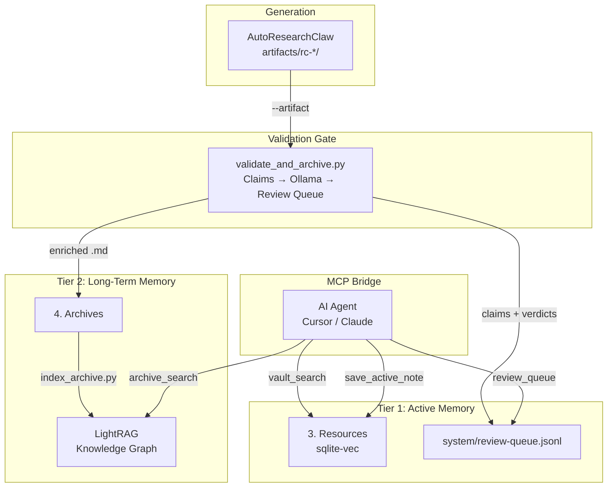

<div align="center">
  <h1>🧠 Zero-Cost Virtual Brain</h1>
  <p><b>A local, private, and free AI memory system powered by LightRAG and MCP.</b></p>
</div>

<p align="center">
  <a href="#features">Features</a> •
  <a href="#architecture">Architecture</a> •
  <a href="#prerequisites">Prerequisites</a> •
  <a href="#installation">Installation</a> •
  <a href="#usage">Usage</a>
</p>

---

The **Zero-Cost Virtual Brain** connects your daily active thought process (your Obsidian vault) with deep, historical knowledge (your archives) by automatically constructing and querying a dense **Knowledge Graph**.

Engineered to run entirely on constrained consumer hardware (e.g., a 6GB VRAM RTX 4050), it ensures your private data never touches the cloud. It features native **Model Context Protocol (MCP)** integration, allowing agents like Claude or Cursor to read, write, and search your personal knowledge base autonomously.

## ✨ Features

- **100% Local & Private:** No APIs required for core functionality. Runs via Ollama, keeping your data strictly on your machine.
- **VRAM Optimized:** Tuned to run both a reasoning model (`qwen3.5:4b`) and an embedding model (`nomic-embed-text`) simultaneously within 6GB VRAM.
- **Knowledge Graph Engine:** Utilizes [LightRAG](https://github.com/HKUDS/LightRAG) to extract entities and relationships, enabling deep, thematic queries across years of archives.
- **Agentic Integration (MCP):** Exposes tools via a FastMCP bridge server with full MCP tool annotations (`readOnlyHint`, `destructiveHint`, `idempotentHint`), turning your vault into long-term memory for AI agents.
- **Validation Harness:** A best-effort claim extraction and validation pipeline that sits between AI-generated papers and LightRAG indexing — flags unverified claims before they reach the knowledge graph.
- **Incremental Indexing:** Smart hashing ensures only new or modified files are processed, saving time and compute.
- **Hybrid Support:** Easily switch between local models and cloud providers (like Google Gemini) via a simple `.env` toggle.

## 🏗️ Architecture

The Brain mimics human memory with two tiers and a validation gate between generation and indexing:



## 📋 Prerequisites

- **Python 3.10+**
- **Ollama:** Installed and running locally.
- **Hardware:** Minimum 6GB VRAM (NVIDIA recommended).

## 🚀 Installation

1. **Clone the repository:**
   ```bash
   git clone https://github.com/asiriji-lab/Personal-ai-archive.git
   cd Personal-ai-archive
   ```

2. **Install Python dependencies:**
   ```bash
   pip install -r requirements.txt
   ```

3. **Pull required local models via Ollama:**
   ```bash
   ollama pull qwen3.5:4b
   ollama pull nomic-embed-text
   ```

4. **Configure environment:**
   ```bash
   cp .env.example .env
   # Edit .env to point VAULT_PATH and ARCHIVE_PATH at your Obsidian vault
   ```

## 💻 Usage

### 1. Build the Brain (Indexing)
Scan archives and build the Knowledge Graph. Subsequent runs process only new or modified files.
```bash
python index_archive.py
```

### 2. Start the MCP Bridge Server
Expose the Brain to AI agents (Claude Desktop, Cursor, VS Code).
```bash
python brain_server.py
```

### 3. Run the Validation Harness
After AutoResearchClaw generates a paper, validate and archive it in one step:
```bash
python scripts/validate_and_archive.py --artifact autoresearchclaw/artifacts/rc-<run_id>/
```

Or run in watch mode to process new artifacts automatically:
```bash
python scripts/validate_and_archive.py --watch
```

The harness will:
- Extract factual claims from the paper
- Validate each claim against Ollama (best-effort, skips if offline)
- Write results to `knowledge_base/system/review-queue.jsonl`
- Enrich the paper with a validation summary and copy it to `4. Archives/`
- Trigger incremental LightRAG indexing on the archived file

### 4. Review Validated Claims
Via the MCP bridge (from any connected agent):
```
review_queue()                    # all entries
review_queue("pending_review")    # awaiting human decision
review_queue("failed")            # claims that did not pass validation
```

### 5. Explore the Graph
```bash
python brain_explorer.py
```

## 📁 Project Structure

### ⚙️ Core Engine
- `config.py` — Central configuration (paths, models, settings).
- `utils.py` — Shared utilities (GPU monitoring, sanitization, chunking).
- `index_archive.py` — Incremental indexer that builds the Knowledge Graph.
- `brain_server.py` — FastMCP server exposing annotated memory tools to AI agents.
- `query.py` — Core logic for executing hybrid semantic searches.
- `embed.py` — Embedding generation and manifest management.

### 🔬 Validation Pipeline
- `scripts/validate_and_archive.py` — Claim extraction, Ollama validation, review queue, archive handoff, and LightRAG indexing trigger.

### 🛠️ Dashboards & Visualization
- `brain_tui.py` — Terminal-based dashboard for system monitoring.
- `brain_explorer.py` — Web-based knowledge graph explorer.
- `visualize_graph.py` — Static graph visualization generator.

### 📥 Data Ingestion
- `fetch_papers.py` — Fetch and archive AI research papers.
- `news_ingest.py` — Ingest news articles into archival memory.
- `watch_archive.py` — Background service for auto-indexing file changes.

### 🧪 Testing & Evaluation
- `test_brain.py` — Interactive CLI for testing graph queries.
- `test_llm_speed.py` — Benchmark tool for local LLM generation speed.
- `eval/run_eval.py` — Evaluation suite for measuring retrieval accuracy.

## 🔧 MCP Tools Reference

| Tool | Type | Description |
|------|------|-------------|
| `archive_search(query)` | read-only | Semantic + graph search over long-term memory (LightRAG) |
| `vault_search(query)` | read-only | Hybrid vector + BM25 search over Resources |
| `save_active_note(title, content)` | destructive | Write a note to `3. Resources` |
| `brain_status()` | read-only | Health check (indexed docs, GPU, provider) |
| `review_queue(status_filter)` | read-only | View validation queue (`all` \| `pending_review` \| `failed` \| `skipped`) |

## ⚙️ Environment Variables

| Variable | Default | Description |
|----------|---------|-------------|
| `BRAIN_LOCAL_MODEL` | `qwen3.5:4b-brain` | Reasoning model for LightRAG |
| `BRAIN_EMBED_MODEL` | `nomic-embed-text` | Embedding model |
| `BRAIN_CONTEXT_WINDOW` | `8192` | LLM context window size |
| `BRAIN_GEMINI_MODEL` | `gemini-2.0-flash` | Gemini model for claims extraction fallback |
| `BRAIN_VALIDATOR_MODEL` | `qwen3.5:4b` | Ollama model for claim validation |
| `BRAIN_VALIDATOR_TIMEOUT` | `15` | Per-claim validation timeout (seconds) |
| `GOOGLE_API_KEY` | — | Gemini API key (optional, for fallback claims extraction) |

---

## 📖 Documentation

- **[Installation & Setup](docs/setup_brain.md):** Detailed step-by-step guide.
- **[Development & Customization](docs/customization.md):** How to modify the brain, add MCP tools, and optimize performance.
- **[Validation Harness Spec](docs/validation-harness.txt):** Full specification for the claims validation pipeline.

---

> **Note:** If you have 8GB+ VRAM, scale up by switching to `qwen2.5:7b` and increasing `BRAIN_CONTEXT_WINDOW` in your `.env`.
