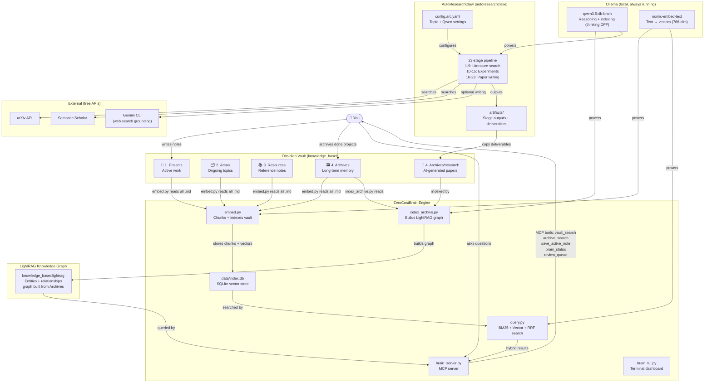
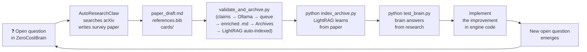

# ZeroCostBrain — Full System Architecture

## The Big Picture



---

## Current Sprint Status

> **Sprint 1 — Complete ✅** (2026-05-03)
> Paper generated, validated, and archived. Findings feed into `query.py` cross-encoder implementation (Sprint 2 pre-work).

```mermaid
gantt
    title Sprint 1 — Cross-encoder Reranking Survey
    dateFormat  X
    axisFormat  Stage %s

    section Done ✅
    Topic + Problem Decompose     :done, 1, 3
    Search Strategy               :done, 3, 4
    Literature Collect (arXiv)    :done, 4, 5
    Literature Screen             :done, 5, 6
    Knowledge Extract             :done, 6, 7
    Synthesis + Hypotheses        :done, 7, 9
    Experiment Design             :done, 9, 10
    Code Generation (Qwen 17min)  :done, 10, 11
    Resource Planning             :done, 11, 12
    Experiment Run                :done, 12, 13
    Iterative Refine              :done, 13, 14
    Result Analysis               :done, 14, 15
    Research Decision             :done, 15, 16
    Paper Outline                 :done, 16, 17
    Paper Draft                   :done, 17, 18
    Peer Review                   :done, 18, 19
    Paper Revision                :done, 19, 20
    Quality Gate                  :done, 20, 21
    Knowledge Archive             :done, 21, 22
    Export + Publish              :done, 22, 23
    Citation Verify               :done, 23, 24
```



---

## The Self-Improvement Loop



---

## Planned Sprints

| Sprint | Topic | Improves | Status |
|--------|-------|----------|--------|
| 1 | Survey of cross-encoder reranking on CPU | `query.py` — add reranker after RRF | ✅ Done (2026-05-03) |
| 2 | Knowledge graph pruning for PKM | `index_archive.py` — pruning pass | ⬜ Planned |
| 3 | Auto MOC generation from entity graphs | New script — auto-writes MOC notes | ⬜ Planned |
| 4 | RAG-based portfolio management | `docs/idea.md` — roadmap update | ⬜ Planned |

---

## File Map

```
ZeroCostBrain/
├── knowledge_base/          ← Obsidian opens this
│   ├── 1. Projects/
│   ├── 2. Areas/
│   ├── 3. Resources/
│   └── 4. Archives/
│       └── research/        ← Papers land here after each sprint
│
├── config.py                ← All settings
├── embed.py                 ← Indexes vault → data/index.db
├── query.py                 ← BM25 + vector + RRF search
├── index_archive.py         ← LightRAG graph builder
├── brain_server.py          ← MCP server for Claude/Cursor
├── brain_tui.py             ← Terminal dashboard
├── news_ingest.py           ← News → Archives
│
├── data/
│   └── index.db             ← SQLite vector store
├── eval/
│   └── run_eval.py          ← Recall@10 evaluation
├── docs/
│   ├── System_Architecture.md       ← YOU ARE HERE
│   ├── dev_log.md           ← Full engineering log (bugs, fixes, sprints)
│   ├── idea.md              ← Original vision & design rationale
│   ├── setup_brain.md       ← Step-by-step setup guide
│   ├── customization.md     ← How to extend the system
│   ├── SPRINT_LOG.md        ← Sprint-by-sprint research tracker
│   ├── system_connectivity.md ← Verified module interaction diagram
│   ├── mcp_tools_reference.md ← API reference for all 5 MCP tools
│   └── validation-harness.md ← Full spec for the claims validation pipeline
├── scripts/                 ← Maintenance utilities
│   ├── prune_graph.py       ← Graph optimization utility
│   └── validate_and_archive.py ← Claims validation harness
└── autoresearchclaw/        ← Research engine
    ├── config.arc.yaml      ← Sprint config
    └── artifacts/           ← Sprint outputs
```
